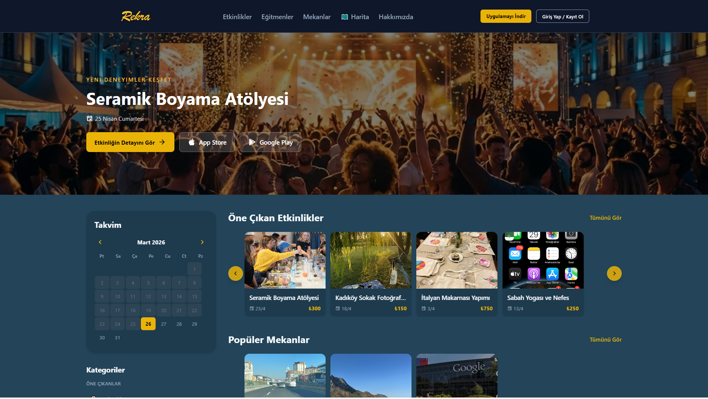
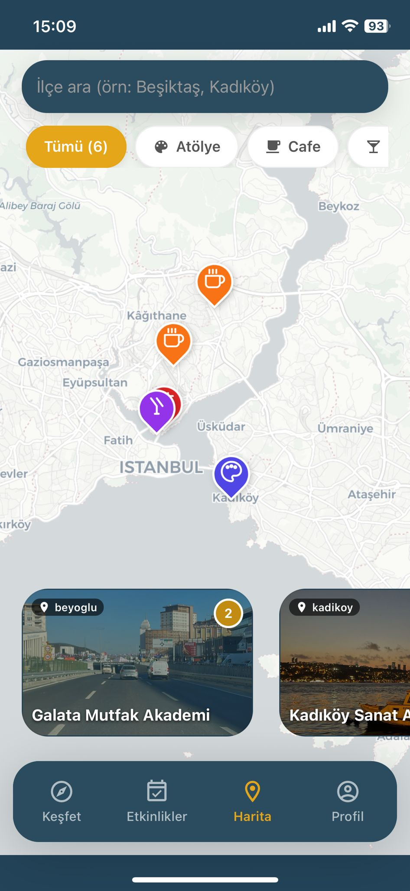
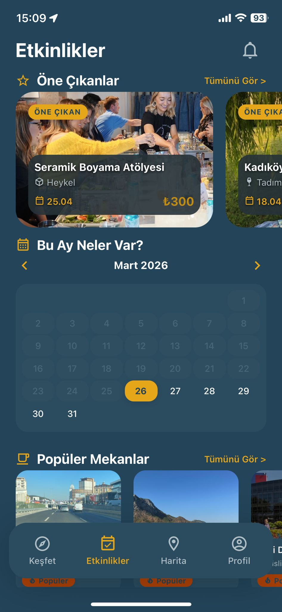
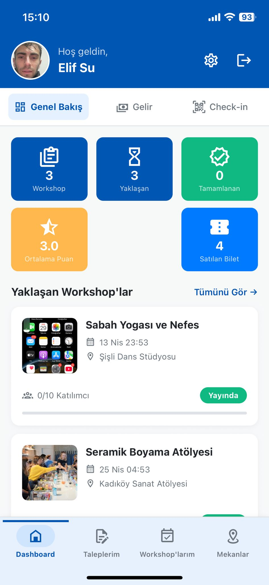
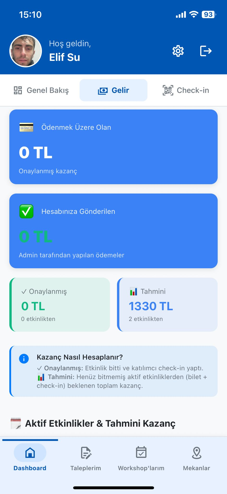
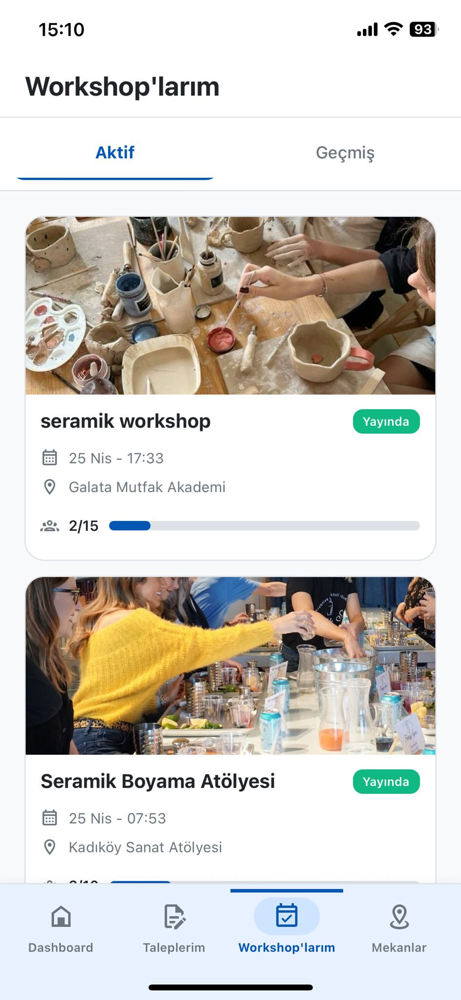
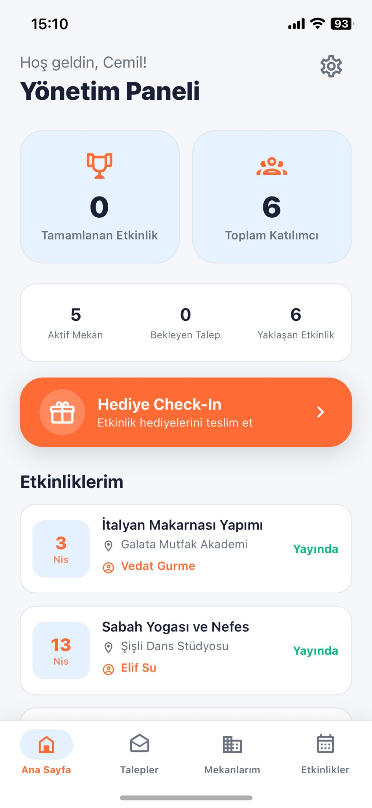
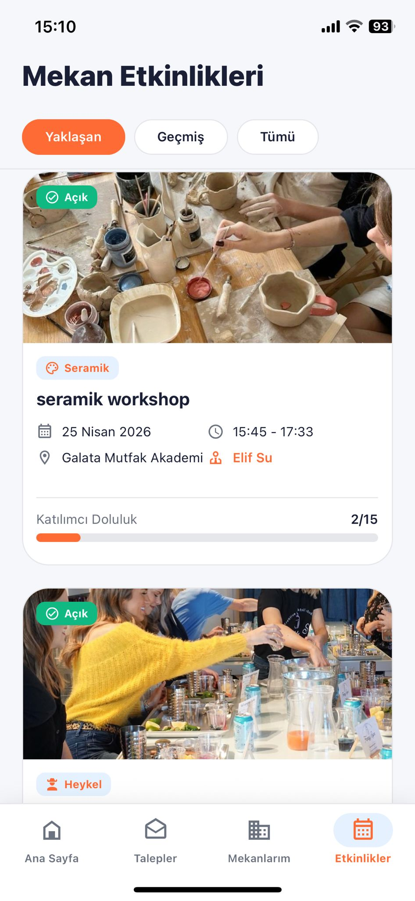
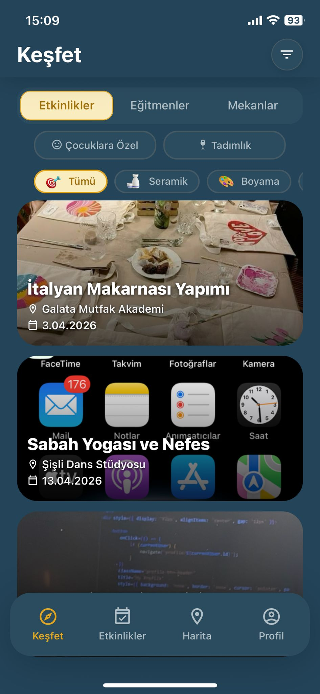

<p align="center">
  
</p>

<h1 align="center">Rekra — Workshop Discovery & Booking Platform</h1>

<p align="center">
  <strong>A full-stack, production-grade mobile platform connecting people with local workshops, instructors, and creative venues.</strong>
</p>

<p align="center">
  <a href="https://rekra.co">🌐 Website</a> •
  <a href="https://apps.apple.com/tr/app/rekra/id6757099648?l=tr">📱 App Store</a>
</p>

<p align="center">
  
  
  
  
  
  
  
  
  
  
  
</p>

---

## 📷 Screenshots

<p align="center">
  
  
  
</p>
<p align="center">
  
  
  
</p>
<p align="center">
  
  
  
</p>

---

## 📋 Overview

**Rekra** is a workshop discovery and booking platform currently **live on iOS** ([App Store](https://apps.apple.com/app/rekra/id6743186340)) and on the web at [rekra.co](https://rekra.co). The platform connects **workshop attendees**, **instructors**, and **venue owners** in a single ecosystem, enabling seamless workshop creation, booking, check-in, and review processes.

> 🚧 **Note:** This project is actively under development. It is currently live on iOS and on the web, but not yet publicly opened to end users. I am building the entire platform — mobile app, backend API, infrastructure, and deployment — as a **solo developer**.

---

## ✨ Key Features

### 👤 For Users (Attendees)
- **Discover Workshops** — Browse ceramics, painting, sculpture, jewelry, 3D printing, and more
- **Interactive Map** — Find nearby workshops and venues with real-time map markers
- **Smart Search & Filters** — Filter by category, district, date, difficulty level, and audience type
- **Booking & QR Tickets** — Register for workshops and receive unique QR codes and 5-digit check-in codes
- **Gift Beverages** — Claim complimentary drinks at partner venues with ticket verification
- **Reviews & Ratings** — Rate both instructors and venues after attending workshops
- **Favorites** — Save workshops, instructors, and venues for quick access
- **Push Notifications** — Get reminders, discount alerts, and booking confirmations via Firebase
- **Social Auth** — Sign in with Google, Apple, or Magic Link (passwordless email login)
- **User Profiles** — Manage personal info, photos, interests, and workshop history

### 🎓 For Instructors
- **Instructor Dashboard** — Track upcoming workshops, earnings, and performance metrics
- **Workshop Creation** — Create workshops with detailed schedules, pricing, and gallery images
- **Venue Browser** — Browse available venues and send rental requests directly to venue owners
- **Venue Request System** — Propose workshop dates, pricing, and requirements to venues
- **Revenue Tracking** — Monitor earnings with configurable instructor revenue share (default 70%)
- **My Workshops** — Manage all created workshops with edit and status control

### 🏠 For Venue Owners
- **Venue Owner Dashboard** — Overview of venues, incoming requests, and hosted workshops
- **Venue Management** — Edit venue details, photos, capacity, facilities, and amenities
- **Request Management** — Approve, reject, or counter instructor workshop proposals
- **Gift Check-in** — Verify and fulfill gift beverage claims for workshop attendees
- **Workshop Calendar** — View all workshops scheduled at owned venues

### 🛡️ Admin Panel
- **Django Admin** — Full control over users, workshops, venues, reviews, and payments
- **Featured Workshops** — Manually curate and order homepage featured content
- **Discount System** — Create discount codes and workshop-specific discounts
- **Notification Center** — Send targeted push notifications to user segments
- **Instructor Payments** — Track and manage instructor payouts
- **Approval Workflows** — Approve instructor and venue owner registrations

---

## 🏗️ Architecture

```
                    ┌──────────────────────────────────────────────┐
                    │               Rekra Mobile App               │
                    │         React Native + Expo SDK 54           │
                    │        TypeScript · iOS · Android            │
                    └─────────────────┬────────────────────────────┘
                                      │
                    REST API (HTTPS)   │   WebSocket (WSS)
                                      │
                    ┌─────────────────▼────────────────────────────┐
                    │              Nginx (Alpine)                   │
                    │     SSL/TLS · Rate Limiting · Gzip            │
                    │     Reverse Proxy · Static File Serving       │
                    └─────────────────┬────────────────────────────┘
                                      │
              ┌───────────────────────▼───────────────────────┐
              │                                               │
    ┌─────────▼──────────┐                      ┌─────────────▼──────────┐
    │   Gunicorn (HTTP)  │                      │   Daphne (ASGI/WS)     │
    │   Django 5 + DRF   │                      │   Django Channels      │
    │   REST API Server  │                      │   Real-time Updates    │
    └─────────┬──────────┘                      └─────────────┬──────────┘
              │                                               │
    ┌─────────▼───────────────────────────────────────────────▼───┐
    │                     Django Backend                           │
    │  JWT Auth · OAuth (Google/Apple) · Magic Links              │
    │  Workshop CRUD · Booking · Reviews · Notifications          │
    │  Discount System · Payment Tracking · Real-time WS          │
    └────┬──────────┬──────────┬──────────┬──────────┬────────────┘
         │          │          │          │          │
    ┌────▼───┐ ┌────▼───┐ ┌───▼────┐ ┌───▼───┐ ┌───▼─────────┐
    │PostgreSQL│ │ Redis  │ │AWS S3  │ │Firebase│ │   Sentry    │
    │   (RDS) │ │(Cache +│ │+Cloud- │ │  FCM   │ │ (Error      │
    │         │ │Channel)│ │ Front) │ │(Push)  │ │  Tracking)  │
    └────────┘ └────────┘ └────────┘ └───────┘ └─────────────┘
```

---

## 🛠️ Tech Stack

### Frontend (Mobile)
| Technology | Purpose |
|---|---|
| **React Native 0.81** | Cross-platform mobile framework |
| **Expo SDK 54** | Managed workflow, OTA updates, EAS builds |
| **TypeScript 5.9** | Type-safe development |
| **React Navigation 7** | Stack-based navigation |
| **Expo Location** | GPS & geolocation services |
| **Expo Notifications** | Push notification handling |
| **Expo Image Picker / Camera** | Media capture and selection |
| **React Native Reanimated** | Smooth 60fps animations |
| **React Native Gesture Handler** | Touch & gesture recognition |
| **React Native QR Code SVG** | QR code generation for tickets |
| **WebSocket (ws)** | Real-time venue updates |
| **Axios** | HTTP client for REST API |
| **AsyncStorage** | Local data persistence |

### Backend
| Technology | Purpose |
|---|---|
| **Django 5.0** | Web framework |
| **Django REST Framework** | RESTful API |
| **Django Channels 4** | WebSocket & async support |
| **SimpleJWT** | JWT authentication |
| **django-allauth** | Social auth (Google, Apple) |
| **drf-spectacular** | OpenAPI/Swagger documentation |
| **Django Storages** | AWS S3 file storage integration |
| **Python 3.11** | Runtime |

### Database & Caching
| Technology | Purpose |
|---|---|
| **PostgreSQL 15** (AWS RDS) | Primary relational database |
| **Redis 7** (AWS ElastiCache) | Caching, session store, Channels backend |
| **django-redis** | Django cache backend |
| **channels-redis** | WebSocket channel layer |

### Infrastructure & DevOps
| Technology | Purpose |
|---|---|
| **Docker** | Multi-stage containerization (dev + production) |
| **Docker Compose** | Multi-service orchestration (backend, redis, nginx) |
| **Nginx** | Reverse proxy, SSL termination, rate limiting, gzip |
| **Gunicorn** | WSGI production server (HTTP) |
| **Daphne** | ASGI production server (WebSocket) |
| **Let's Encrypt** | Free SSL/TLS certificates |

### AWS Cloud Services
| Service | Purpose |
|---|---|
| **EC2** | Application server hosting |
| **S3** | Media & static file storage |
| **CloudFront** | CDN for media delivery |
| **CloudWatch** | Centralized logging & monitoring |
| **RDS** (PostgreSQL) | Managed database |
| **ElastiCache** (Redis) | Managed cache & message broker |
| **Elastic Beanstalk** | Deployment management |

### Monitoring & Security
| Technology | Purpose |
|---|---|
| **Sentry** | Error tracking & performance monitoring |
| **Firebase Admin SDK** | Push notifications (FCM) |
| **HSTS / CSP / XSS Headers** | Security hardening |
| **Rate Limiting** | API & auth endpoint protection |
| **CORS** | Cross-origin request control |

---

## 📱 App Screens

| Screen | Description |
|---|---|
| `WorkshopListScreen` | Home feed with featured and upcoming workshops |
| `WorkshopDetailScreen` | Full workshop info, schedule, instructor, booking |
| `WorkshopSearchScreen` | Advanced search with category/location/date filters |
| `MapScreen` | Interactive map with venue and workshop markers |
| `InstructorDashboardScreen` | Instructor analytics, earnings, and workshop management |
| `VenueOwnerDashboardScreen` | Venue analytics, requests, and workshop calendar |
| `InstructorVenueBrowserScreen` | Browse and request venues for workshops |
| `VenueRequestFormScreen` | Detailed venue rental request form |
| `PaymentScreen` | Booking and payment flow |
| `TicketDetailScreen` | QR code ticket with check-in code |
| `ProfileScreen` | User profile with stats and workshop history |
| `NotificationScreen` | In-app notification center |
| `FavoritesScreen` | Saved workshops, venues, and instructors |
| `WorkshopReviewScreen` | Post-workshop rating and review form |

---

## 🗃️ Database Models

The backend features a rich data model with **15+ models** including:

- `User` — Extended AbstractUser with instructor/venue_owner roles, social auth, FCM tokens
- `Venue` — Workshop locations with capacity, facilities, amenities, and owner management
- `Workshop` — Full workshop model with scheduling, pricing, revenue share, program timeline
- `FeaturedWorkshop` — Admin-curated homepage content
- `VenueRequest` — Instructor-to-venue booking request workflow
- `WorkshopParticipant` — Booking records with QR tickets, check-in codes, and gift tracking
- `InstructorReview` / `VenueReview` — Dual-review system with verified participant badges
- `InstructorPayment` — Revenue tracking and payout management
- `WorkshopDiscount` / `DiscountCode` / `DiscountCodeUsage` — Full discount and coupon system
- `Notification` — Multi-type notification system with Firebase push integration
- `MagicLinkToken` — Passwordless authentication via email
- `Favorite` — Polymorphic favorites for workshops, events, instructors, and venues
- `FAQ` — Categorized frequently asked questions

---

## 🚀 Deployment

The application is deployed to **AWS** with a containerized architecture:

```bash
# Production deployment
docker-compose -f docker-compose.yml -f docker-compose.prod.yml up -d
```

**Production Stack:**
- **Docker Compose** orchestrating 3 services: Django backend, Redis, and Nginx
- **Nginx** handling SSL (Let's Encrypt), reverse proxy, rate limiting, static/media serving
- **Gunicorn** (4 workers, 2 threads) for HTTP traffic
- **Daphne** for WebSocket connections
- **CloudFront CDN** for media delivery from S3
- **CloudWatch** for centralized logging (`awslogs` driver)
- **Health checks** with automatic container restart on failure

---

## 🔒 Security

- JWT-based authentication with refresh token rotation
- Social OAuth 2.0 (Google & Apple Sign-In)
- Magic Link passwordless authentication
- SSL/TLS encryption with HSTS preloading
- Rate limiting on auth endpoints (10 req/min) and API endpoints (30 req/sec)
- Security headers: X-Frame-Options, X-Content-Type-Options, X-XSS-Protection
- Firebase credentials secured via environment variables
- CORS whitelist configuration
- `.env` and sensitive files excluded from version control

---

## 🔮 Roadmap

- [ ] Android release on Google Play Store
- [ ] In-app payment integration (Stripe/iyzico)
- [ ] Workshop certificate generation (PDF)
- [ ] Real-time chat between instructors and venue owners
- [ ] AI-powered workshop recommendations
- [ ] Advanced analytics dashboard
- [ ] Multi-city expansion beyond Istanbul
- [ ] Workshop scheduling with calendar sync
- [ ] Rich media push notifications
- [ ] Instructor verification badges

---

## 👨‍💻 Solo Developer

This entire platform — **mobile app, backend API, database design, cloud infrastructure, CI/CD, and deployment** — is built and maintained by a single developer. The project demonstrates end-to-end full-stack engineering capabilities, from React Native mobile development to AWS cloud architecture.

---

## 📄 License

This repository is for **portfolio and demonstration purposes**. The source code is proprietary and not available for redistribution or commercial use.

---

<p align="center">
  <strong>Rekra</strong> — Discover. Create. Experience. 🎨
</p>
